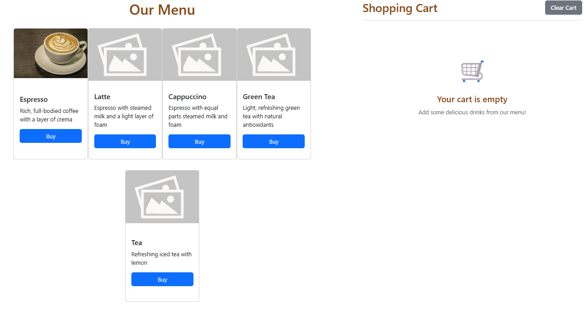
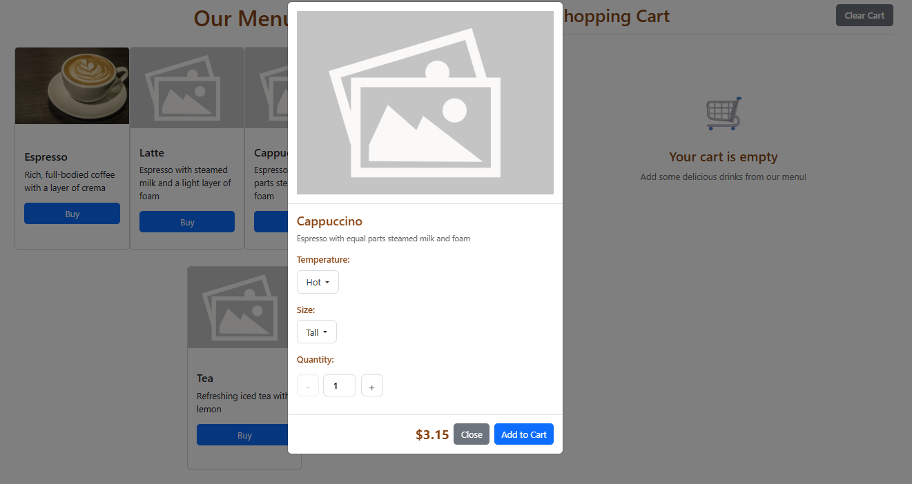
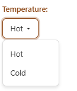
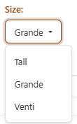
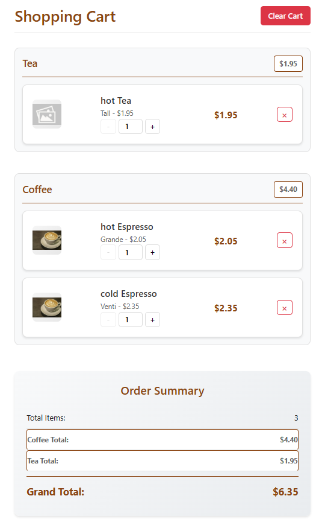

# Coffee Menu
## To start a local development server, run:

```bash
ng serve
```

# Questions
 
1. If we add a new drink (e.g., Mocha), what part of your code would need changes?   
In the medu-data file in the data folder, add a new array with all the drink details inside. My code is used to loop out from the Json file, thus no major changes to the code is needed.


2. If we add a new size (e.g., Short or Trenta), how would your app adapt?  
The size option is completed based on the json file as well as 1 of the collumn is called size. As long as the size and price is put into the array in the price column, the app will automatically be added inside as one of the options.


3. How would you extend your app to allow adding “condiments” (like pearl, grass jelly, whipped cream)?  
Add another section for condiments in the model as a drop down box. In the cart, it will also display the condiments and the price to the side of the condiments

# ScreenShots





